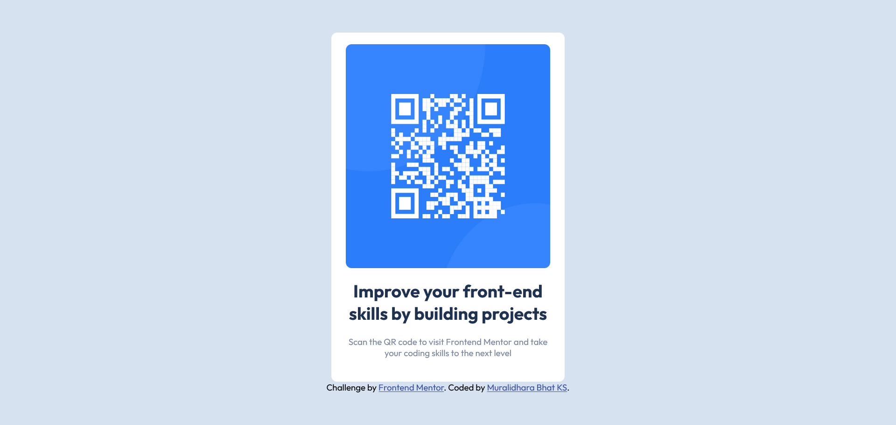

# Frontend Mentor - QR code component solution

This is a solution to the [QR code component challenge on Frontend Mentor](https://www.frontendmentor.io/challenges/qr-code-component-iux_sIO_H). Frontend Mentor challenges help you improve your coding skills by building realistic projects.

## Table of contents

- [Overview](#overview)
  - [Screenshot](#screenshot)
  - [Links](#links)
- [My process](#my-process)
  - [Built with](#built-with)
  - [What I learned](#what-i-learned)
  - [Continued development](#continued-development)
- [Author](#author)
- [Acknowledgments](#acknowledgments)

**Note: Delete this note and update the table of contents based on what sections you keep.**

## Overview

### Screenshot

### Links

- Solution URL: [GitHub](https://github.com/SlenderShield/qr-code-component-main)
- Live Site URL: [qr-code-component-main](https://muralidharabhat.me/qr-code-component-main/)

## My process

### Built with

- Semantic HTML5 markup
- CSS properties
- Flexbox

### What I learned

The positioning of html element in the page and the way to do so.
The two most important points i learned was that patience and googling is key to success.

### Continued development

I want to learn more about the css styling and how to positioning works in css.

## Author

- Website - [Muralidhara Bhat KS](https://muralidharabhat.me)
- Frontend Mentor - [@SlenderShield](https://www.frontendmentor.io/profile/SlenderShield)
- Twitter - [@myself_MDB](https://www.twitter.com/myself_MDB)

## Acknowledgments

The most important person who helped is google and also I thank myself for consistently working on the challenge
